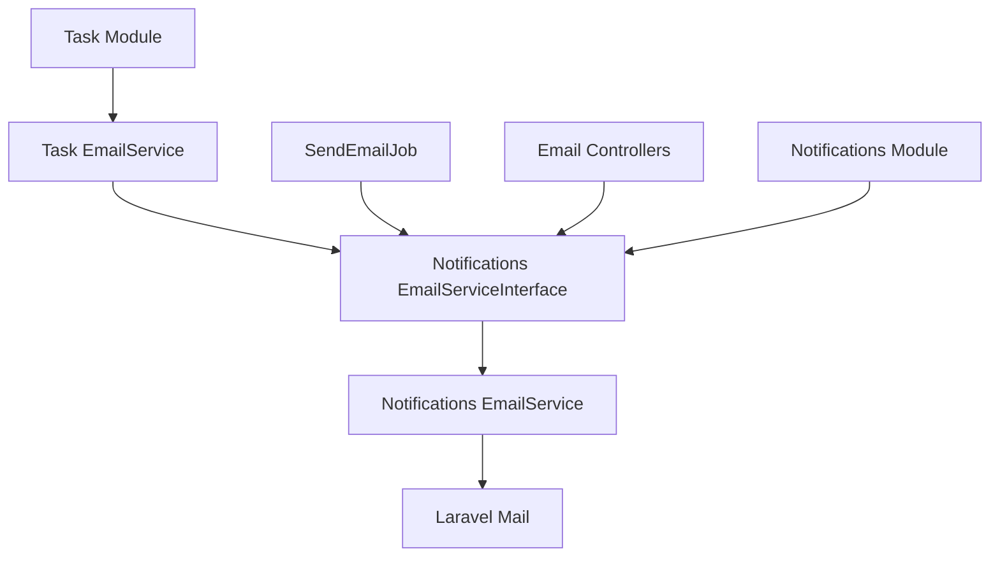

# 📧 Email System Architecture - Clean Architecture Implementation

## 🎯 **Tổng quan**

Hệ thống email đã được refactor để tuân theo **Clean Architecture** và **Dependency Inversion Principle**, loại bỏ trùng lặp code và tập trung hóa logic email vào một nơi.

## 🏗️ **Kiến trúc mới**

### **1. EmailServiceInterface (Notifications Module)**
- **Vị trí**: `Modules/Notifications/app/Services/EmailService/EmailServiceInterface.php`
- **Chức năng**: Interface chung định nghĩa contract cho tất cả email operations
- **Nguyên tắc**: Dependency Inversion Principle - phụ thuộc vào abstraction, không phụ thuộc vào concrete class

### **2. EmailService (Notifications Module)**
- **Vị trí**: `Modules/Notifications/app/Services/EmailService/EmailService.php`
- **Chức năng**: Implementation chính của tất cả email logic
- **Tính năng**:
  - Gửi email notification đơn giản
  - Gửi email với template
  - Gửi email hàng loạt
  - Gửi email báo cáo (cho Task module)
  - Kiểm tra kết nối email
  - Lấy email của user theo type

### **3. Task EmailService (Facade Pattern)**
- **Vị trí**: `Modules/Task/app/Services/EmailService.php`
- **Chức năng**: Facade pattern - delegate tất cả operations đến Notifications EmailService
- **Lợi ích**:
  - Task module không cần implement email logic
  - Tuân theo Single Responsibility Principle
  - Dễ dàng maintain và extend

### **4. SendEmailJob (Task Module)**
- **Vị trí**: `Modules/Task/app/Jobs/SendEmailJob.php`
- **Chức năng**: Job xử lý email báo cáo sử dụng Notifications EmailService
- **Cải tiến**: Sử dụng dependency injection thay vì hardcode logic

## 🔄 **Luồng hoạt động**



## 📋 **Các thay đổi chính**

### **1. Loại bỏ trùng lặp**
- ❌ Xóa logic email trùng lặp trong Task module
- ✅ Tập trung tất cả email logic vào Notifications module

### **2. Dependency Injection**
- ✅ Task EmailService inject Notifications EmailServiceInterface
- ✅ SendEmailJob inject EmailServiceInterface
- ✅ Service Providers bind interfaces đúng cách

### **3. Clean Architecture**
- ✅ Task module chỉ chứa business logic của Task
- ✅ Email logic được tách riêng vào Notifications module
- ✅ Interface segregation và dependency inversion

## 🚀 **Cách sử dụng**

### **Trong Task Module:**
```php
// Inject Task EmailService
public function __construct(EmailService $emailService)
{
    $this->emailService = $emailService;
}

// Sử dụng như bình thường
$this->emailService->sendReportEmail($emailDTO);
```

### **Trong Notifications Module:**
```php
// Inject Notifications EmailService
public function __construct(EmailServiceInterface $emailService)
{
    $this->emailService = $emailService;
}

// Sử dụng trực tiếp
$this->emailService->send($userId, $userType, $content, $subject);
```

## 🔧 **Service Provider Configuration**

### **Notifications Service Provider:**
```php
// Bind interface to implementation
$this->app->bind(EmailServiceInterface::class, EmailService::class);

// Singleton để tái sử dụng
$this->app->singleton(EmailService::class, function ($app) {
    return new EmailService();
});
```

### **Task Service Provider:**
```php
// Bind Notifications EmailService
$this->app->bind(NotificationsEmailServiceInterface::class, NotificationsEmailService::class);

// Bind Task EmailService sử dụng Notifications EmailService
$this->app->bind(EmailService::class, function ($app) {
    return new EmailService($app->make(NotificationsEmailServiceInterface::class));
});
```

## ✅ **Lợi ích**

1. **Loại bỏ trùng lặp**: Chỉ có một implementation email logic
2. **Dễ bảo trì**: Thay đổi email logic chỉ cần sửa ở Notifications module
3. **Tuân theo SOLID**: Single Responsibility, Dependency Inversion
4. **Tương thích ngược**: Task module vẫn hoạt động bình thường
5. **Mở rộng được**: Dễ dàng thêm tính năng email mới
6. **Testable**: Có thể mock EmailServiceInterface dễ dàng

## 🎯 **Kết luận**

Hệ thống email đã được tối ưu hóa theo Clean Architecture, loại bỏ trùng lặp code và tập trung hóa logic email. Task module giờ đây chỉ tập trung vào business logic của Task, trong khi email logic được quản lý tập trung trong Notifications module.
