# 🎯 Task Module - Hướng dẫn Tích hợp Frontend

## 📚 Tổng quan Module

Task Module là hệ thống quản lý nhiệm vụ và bài tập hoàn chỉnh với các tính năng:

- **📋 Task Management**: Tạo, cập nhật, giao, nộp, chấm điểm tasks
- **📅 Calendar Integration**: Quản lý sự kiện và deadline
- **🔔 Notification System**: Thông báo đa kênh (Email, Push, SMS, In-app)
- **📊 Analytics & Reports**: Thống kê và báo cáo chi tiết
- **👥 Role-based Access**: Phân quyền Admin, Lecturer, Student
- **⏰ Reminder System**: Nhắc nhở tự động và thủ công

---

## 🎭 Phân quyền và Vai trò

### **🔧 ADMIN (Quản trị viên)**
**Quyền hạn:**
- ✅ Xem tất cả tasks trong hệ thống
- ✅ Tạo/sửa/xóa bất kỳ task nào
- ✅ Giao task cho bất kỳ ai
- ✅ Xem thống kê toàn hệ thống
- ✅ Quản lý người dùng và phân quyền
- ✅ Xuất báo cáo tổng hợp
- ✅ Override trạng thái task

**API Endpoints:**
```javascript
// Admin endpoints
GET    /api/v1/admin-tasks                    // Tất cả tasks
POST   /api/v1/admin-tasks                    // Tạo task
GET    /api/v1/admin-tasks/system-statistics  // Thống kê hệ thống
PATCH  /api/v1/admin-tasks/{id}/override-status // Ghi đè trạng thái
POST   /api/v1/admin-tasks/bulk-action        // Thao tác hàng loạt
```

### **👨‍🏫 LECTURER (Giảng viên)**
**Quyền hạn:**
- ✅ Tạo tasks cho sinh viên
- ✅ Xem tasks đã tạo và được giao
- ✅ Chấm điểm và nhận xét
- ✅ Xem thống kê lớp học
- ✅ Xuất báo cáo lớp
- ✅ Quản lý deadline và priority

**API Endpoints:**
```javascript
// Lecturer endpoints
GET    /api/v1/lecturer-tasks                 // Tasks của giảng viên
POST   /api/v1/lecturer-tasks                 // Tạo task mới
GET    /api/v1/lecturer-tasks/created         // Tasks đã tạo
GET    /api/v1/lecturer-tasks/assigned        // Tasks được giao
GET    /api/v1/lecturer-tasks/statistics      // Thống kê giảng viên
POST   /api/v1/lecturer-tasks/recurring       // Tạo task định kỳ
```

### **👨‍🎓 STUDENT (Sinh viên)**
**Quyền hạn:**
- ✅ Xem tasks được giao
- ✅ Nộp bài và upload files
- ✅ Xem điểm và nhận xét
- ✅ Xem thống kê cá nhân
- ✅ Tạo reminders cho deadline

**API Endpoints:**
```javascript
// Student endpoints
GET    /api/v1/student-tasks                  // Tasks của sinh viên
GET    /api/v1/student-tasks/pending          // Tasks chờ xử lý
GET    /api/v1/student-tasks/submitted        // Tasks đã nộp
GET    /api/v1/student-tasks/overdue          // Tasks quá hạn
PUT    /api/v1/student-tasks/{id}/submission  // Cập nhật bài nộp
```

---

## 🔄 Workflow và Luồng Hoạt động

### **1. 📝 Tạo Task (Lecturer/Admin)**

```mermaid
graph TD
    A[Lecturer tạo task] --> B[Chọn receivers]
    B --> C[Set deadline & priority]
    C --> D[Upload files đính kèm]
    D --> E[Lưu task]
    E --> F[Gửi thông báo cho receivers]
    F --> G[Tạo automatic reminders]
```



**Frontend Implementation:**
```javascript
// Tạo task mới
const createTask = async (taskData) => {
  const response = await fetch('/api/v1/lecturer-tasks', {
    method: 'POST',
    headers: {
      'Authorization': `Bearer ${token}`,
      'Content-Type': 'application/json'
    },
    body: JSON.stringify({
      title: 'Assignment 1',
      description: 'Complete the project',
      deadline: '2025-02-15 23:59:59',
      priority: 'high',
      receivers: [
        {id: 123, type: 'student'},
        {id: 124, type: 'student'}
      ],
      files: [/* file objects */]
    })
  });
  
  if (response.ok) {
    // Task created successfully
    // Show success message
    // Redirect to task list
  }
};
```

### **2. 📤 Nộp Task (Student)**

```mermaid
graph TD
    A[Student xem task] --> B[Làm bài]
    B --> C[Upload files]
    C --> D[Submit task]
    D --> E[Gửi thông báo cho lecturer]
    E --> F[Update task status]
```



**Frontend Implementation:**
```javascript
// Nộp task
const submitTask = async (taskId, submissionData) => {
  const formData = new FormData();
  formData.append('content', submissionData.content);
  formData.append('files', submissionData.files);
  
  const response = await fetch(`/api/v1/tasks/${taskId}/submit`, {
    method: 'POST',
    headers: {
      'Authorization': `Bearer ${token}`
    },
    body: formData
  });
  
  if (response.ok) {
    // Task submitted successfully
    // Show success message
    // Update UI
  }
};
```

### **3. 📊 Chấm điểm (Lecturer)**

```mermaid
graph TD
    A[Lecturer xem submission] --> B[Chấm điểm]
    B --> C[Viết nhận xét]
    C --> D[Lưu grade]
    D --> E[Gửi thông báo cho student]
    E --> F[Update task status]
```



**Frontend Implementation:**
```javascript
// Chấm điểm task
const gradeTask = async (taskId, gradeData) => {
  const response = await fetch(`/api/v1/lecturer-tasks/${taskId}/grade`, {
    method: 'POST',
    headers: {
      'Authorization': `Bearer ${token}`,
      'Content-Type': 'application/json'
    },
    body: JSON.stringify({
      grade: 85,
      max_grade: 100,
      feedback: 'Great work!',
      comments: 'Good understanding of concepts'
    })
  });
  
  if (response.ok) {
    // Task graded successfully
    // Show success message
    // Update UI
  }
};
```

---

## 📊 Dashboard và Analytics

### **1. 📈 Dashboard Overview**

**Dữ liệu cần thiết:**
```javascript
// Lấy dữ liệu dashboard
const getDashboardData = async () => {
  const response = await fetch('/api/v1/reports/dashboard-summary', {
    headers: {
      'Authorization': `Bearer ${token}`
    }
  });
  
  const data = await response.json();
  
  return {
    userStats: data.data.user_statistics,
    overviewStats: data.data.overview_statistics,
    recentActivities: data.data.recent_activities,
    overdueTasks: data.data.overdue_tasks,
    upcomingDeadlines: data.data.upcoming_deadlines
  };
};
```

**Components cần thiết:**
- **📊 Statistics Cards**: Tổng tasks, completed, pending, overdue
- **📈 Charts**: Completion rate, priority distribution, trend
- **📋 Recent Activities**: Danh sách hoạt động gần đây
- **⚠️ Alerts**: Tasks quá hạn, deadline sắp tới
- **📅 Calendar**: Lịch sự kiện và deadline

### **2. 📊 Statistics Charts**

**Completion Rate Chart:**
```javascript
const getCompletionRateData = async () => {
  const response = await fetch('/api/v1/statistics/completion-rate?period=month');
  const data = await response.json();
  
  // Format data for chart library (Chart.js, D3.js, etc.)
  return {
    labels: data.data.periods,
    datasets: [{
      label: 'Completion Rate',
      data: data.data.rates,
      backgroundColor: 'rgba(54, 162, 235, 0.2)',
      borderColor: 'rgba(54, 162, 235, 1)'
    }]
  };
};
```

**Priority Distribution Chart:**
```javascript
const getPriorityDistributionData = async () => {
  const response = await fetch('/api/v1/statistics/priority-distribution');
  const data = await response.json();
  
  return {
    labels: ['Low', 'Medium', 'High', 'Urgent'],
    datasets: [{
      data: [
        data.data.low,
        data.data.medium,
        data.data.high,
        data.data.urgent
      ],
      backgroundColor: [
        '#28a745', // Green for low
        '#ffc107', // Yellow for medium
        '#fd7e14', // Orange for high
        '#dc3545'  // Red for urgent
      ]
    }]
  };
};
```

---

## 🔔 Notification System

### **1. 📧 Email Notifications**

**Templates có sẵn:**
- `task_created` - Task mới được tạo
- `task_updated` - Task được cập nhật
- `task_assigned` - Task được giao
- `task_submitted` - Task được nộp
- `task_graded` - Task được chấm điểm

**Frontend không cần xử lý email, chỉ cần:**
- Hiển thị thông báo khi có task mới
- Update UI khi task được cập nhật
- Show notification khi có grade mới

### **2. 🔔 Real-time Notifications**

**WebSocket Integration:**
```javascript
// Kết nối WebSocket để nhận real-time notifications
const socket = new WebSocket('ws://localhost:6001');

socket.onmessage = (event) => {
  const notification = JSON.parse(event.data);
  
  switch(notification.type) {
    case 'task_created':
      showNotification('New task assigned', notification.data);
      break;
    case 'task_graded':
      showNotification('Task graded', notification.data);
      break;
    case 'task_updated':
      showNotification('Task updated', notification.data);
      break;
  }
};
```

**Push Notifications:**
```javascript
// Đăng ký push notifications
const registerPushNotifications = async () => {
  if ('serviceWorker' in navigator && 'PushManager' in window) {
    const registration = await navigator.serviceWorker.register('/sw.js');
    const subscription = await registration.pushManager.subscribe({
      userVisibleOnly: true,
      applicationServerKey: 'YOUR_VAPID_PUBLIC_KEY'
    });
    
    // Gửi subscription lên server
    await fetch('/api/v1/notifications/subscribe', {
      method: 'POST',
      headers: {
        'Authorization': `Bearer ${token}`,
        'Content-Type': 'application/json'
      },
      body: JSON.stringify(subscription)
    });
  }
};
```

---

## 📅 Calendar Integration

### **1. 📆 Calendar View**

**Lấy events theo ngày:**
```javascript
const getEventsByDate = async (date) => {
  const response = await fetch(`/api/v1/calendar/events/by-date?date=${date}`, {
    headers: {
      'Authorization': `Bearer ${token}`
    }
  });
  
  const data = await response.json();
  return data.data.events;
};
```

**Lấy events theo khoảng thời gian:**
```javascript
const getEventsByRange = async (startDate, endDate) => {
  const response = await fetch(`/api/v1/calendar/events/by-range?start_date=${startDate}&end_date=${endDate}`, {
    headers: {
      'Authorization': `Bearer ${token}`
    }
  });
  
  const data = await response.json();
  return data.data.events;
};
```

### **2. 📅 Calendar Components**

**FullCalendar Integration:**
```javascript
// Sử dụng FullCalendar.js
document.addEventListener('DOMContentLoaded', function() {
  const calendarEl = document.getElementById('calendar');
  const calendar = new FullCalendar.Calendar(calendarEl, {
    initialView: 'dayGridMonth',
    events: async function(info) {
      const events = await getEventsByRange(info.startStr, info.endStr);
      return events.map(event => ({
        id: event.id,
        title: event.title,
        start: event.start_date,
        end: event.end_date,
        color: getEventColor(event.type)
      }));
    },
    eventClick: function(info) {
      // Xử lý click vào event
      showTaskDetails(info.event.id);
    }
  });
  
  calendar.render();
});
```

---

## 📋 Task Management UI

### **1. 📝 Task List Component**

**Task List với Filtering:**
```javascript
const TaskList = () => {
  const [tasks, setTasks] = useState([]);
  const [filters, setFilters] = useState({
    status: 'all',
    priority: 'all',
    date_range: 'all'
  });
  
  const fetchTasks = async () => {
    const queryParams = new URLSearchParams(filters);
    const response = await fetch(`/api/v1/tasks?${queryParams}`, {
      headers: {
        'Authorization': `Bearer ${token}`
      }
    });
    
    const data = await response.json();
    setTasks(data.data);
  };
  
  useEffect(() => {
    fetchTasks();
  }, [filters]);
  
  return (
    <div className="task-list">
      <TaskFilters filters={filters} onFilterChange={setFilters} />
      <div className="tasks">
        {tasks.map(task => (
          <TaskCard key={task.id} task={task} onUpdate={fetchTasks} />
        ))}
      </div>
    </div>
  );
};
```

**Task Card Component:**
```javascript
const TaskCard = ({ task, onUpdate }) => {
  const getPriorityColor = (priority) => {
    const colors = {
      low: 'green',
      medium: 'yellow',
      high: 'orange',
      urgent: 'red'
    };
    return colors[priority] || 'gray';
  };
  
  const getStatusBadge = (status) => {
    const badges = {
      pending: { text: 'Pending', class: 'badge-warning' },
      in_progress: { text: 'In Progress', class: 'badge-info' },
      completed: { text: 'Completed', class: 'badge-success' },
      overdue: { text: 'Overdue', class: 'badge-danger' }
    };
    return badges[status] || { text: status, class: 'badge-secondary' };
  };
  
  return (
    <div className="task-card">
      <div className="task-header">
        <h3>{task.title}</h3>
        <span className={`priority-badge priority-${getPriorityColor(task.priority)}`}>
          {task.priority.toUpperCase()}
        </span>
      </div>
      
      <div className="task-body">
        <p>{task.description}</p>
        <div className="task-meta">
          <span>Deadline: {formatDate(task.deadline)}</span>
          <span className={`status-badge ${getStatusBadge(task.status).class}`}>
            {getStatusBadge(task.status).text}
          </span>
        </div>
      </div>
      
      <div className="task-actions">
        <button onClick={() => viewTask(task.id)}>View</button>
        {task.status === 'pending' && (
          <button onClick={() => submitTask(task.id)}>Submit</button>
        )}
      </div>
    </div>
  );
};
```

### **2. 📤 Task Submission Form**

**File Upload Component:**
```javascript
const TaskSubmissionForm = ({ taskId }) => {
  const [submission, setSubmission] = useState({
    content: '',
    files: []
  });
  
  const handleFileUpload = (event) => {
    const files = Array.from(event.target.files);
    setSubmission(prev => ({
      ...prev,
      files: [...prev.files, ...files]
    }));
  };
  
  const handleSubmit = async (e) => {
    e.preventDefault();
    
    const formData = new FormData();
    formData.append('content', submission.content);
    submission.files.forEach(file => {
      formData.append('files[]', file);
    });
    
    const response = await fetch(`/api/v1/tasks/${taskId}/submit`, {
      method: 'POST',
      headers: {
        'Authorization': `Bearer ${token}`
      },
      body: formData
    });
    
    if (response.ok) {
      alert('Task submitted successfully!');
      // Redirect or update UI
    }
  };
  
  return (
    <form onSubmit={handleSubmit} className="submission-form">
      <div className="form-group">
        <label>Submission Content:</label>
        <textarea
          value={submission.content}
          onChange={(e) => setSubmission(prev => ({...prev, content: e.target.value}))}
          rows="10"
          required
        />
      </div>
      
      <div className="form-group">
        <label>Upload Files:</label>
        <input
          type="file"
          multiple
          onChange={handleFileUpload}
        />
        <div className="file-list">
          {submission.files.map((file, index) => (
            <div key={index} className="file-item">
              {file.name} ({formatFileSize(file.size)})
            </div>
          ))}
        </div>
      </div>
      
      <button type="submit" className="btn btn-primary">
        Submit Task
      </button>
    </form>
  );
};
```

---

## 📊 Reports và Export

### **1. 📈 Statistics Dashboard**

**Real-time Statistics:**
```javascript
const StatisticsDashboard = () => {
  const [stats, setStats] = useState({});
  
  useEffect(() => {
    const fetchStats = async () => {
      const [userStats, overviewStats, completionRate] = await Promise.all([
        fetch('/api/v1/statistics/user').then(r => r.json()),
        fetch('/api/v1/statistics/overview').then(r => r.json()),
        fetch('/api/v1/statistics/completion-rate').then(r => r.json())
      ]);
      
      setStats({
        user: userStats.data,
        overview: overviewStats.data,
        completionRate: completionRate.data
      });
    };
    
    fetchStats();
    
    // Refresh every 5 minutes
    const interval = setInterval(fetchStats, 300000);
    return () => clearInterval(interval);
  }, []);
  
  return (
    <div className="statistics-dashboard">
      <div className="stats-cards">
        <StatCard title="Total Tasks" value={stats.user?.total_tasks} />
        <StatCard title="Completed" value={stats.user?.completed_tasks} />
        <StatCard title="Pending" value={stats.user?.pending_tasks} />
        <StatCard title="Overdue" value={stats.user?.overdue_tasks} />
      </div>
      
      <div className="charts">
        <CompletionRateChart data={stats.completionRate} />
        <PriorityDistributionChart data={stats.overview?.priority_distribution} />
      </div>
    </div>
  );
};
```

### **2. 📄 Export Reports**

**Export Functionality:**
```javascript
const ExportReports = () => {
  const exportReport = async (format, type) => {
    const params = new URLSearchParams({
      type: type,
      format: format,
      start_date: '2025-01-01',
      end_date: '2025-01-31'
    });
    
    const response = await fetch(`/api/v1/reports/export/${format}?${params}`, {
      headers: {
        'Authorization': `Bearer ${token}`
      }
    });
    
    if (response.ok) {
      const blob = await response.blob();
      const url = window.URL.createObjectURL(blob);
      const a = document.createElement('a');
      a.href = url;
      a.download = `report.${format}`;
      a.click();
      window.URL.revokeObjectURL(url);
    }
  };
  
  return (
    <div className="export-reports">
      <h3>Export Reports</h3>
      <div className="export-options">
        <button onClick={() => exportReport('excel', 'comprehensive')}>
          Export Excel
        </button>
        <button onClick={() => exportReport('pdf', 'student-progress')}>
          Export PDF
        </button>
        <button onClick={() => exportReport('csv', 'class-performance')}>
          Export CSV
        </button>
      </div>
    </div>
  );
};
```

---

## 🔧 Error Handling và Validation

### **1. ⚠️ Error Handling**

**Global Error Handler:**
```javascript
const handleApiError = (error, response) => {
  if (response?.status === 401) {
    // Unauthorized - redirect to login
    window.location.href = '/login';
  } else if (response?.status === 403) {
    // Forbidden - show access denied message
    showNotification('Access denied', 'error');
  } else if (response?.status === 422) {
    // Validation error - show field errors
    const errors = response.data.errors;
    showValidationErrors(errors);
  } else {
    // Generic error
    showNotification('An error occurred', 'error');
  }
};

const apiCall = async (url, options = {}) => {
  try {
    const response = await fetch(url, {
      ...options,
      headers: {
        'Authorization': `Bearer ${token}`,
        'Content-Type': 'application/json',
        ...options.headers
      }
    });
    
    if (!response.ok) {
      const errorData = await response.json();
      handleApiError(errorData, response);
      throw new Error(errorData.message || 'Request failed');
    }
    
    return await response.json();
  } catch (error) {
    console.error('API Error:', error);
    throw error;
  }
};
```

### **2. ✅ Form Validation**

**Client-side Validation:**
```javascript
const validateTaskForm = (formData) => {
  const errors = {};
  
  if (!formData.title || formData.title.trim().length < 3) {
    errors.title = 'Title must be at least 3 characters';
  }
  
  if (!formData.deadline) {
    errors.deadline = 'Deadline is required';
  } else if (new Date(formData.deadline) <= new Date()) {
    errors.deadline = 'Deadline must be in the future';
  }
  
  if (!formData.receivers || formData.receivers.length === 0) {
    errors.receivers = 'At least one receiver is required';
  }
  
  return {
    isValid: Object.keys(errors).length === 0,
    errors
  };
};
```

---

## 🚀 Performance Optimization

### **1. ⚡ Caching Strategy**

**API Response Caching:**
```javascript
const cache = new Map();
const CACHE_DURATION = 5 * 60 * 1000; // 5 minutes

const getCachedData = async (url, fetcher) => {
  const cached = cache.get(url);
  
  if (cached && Date.now() - cached.timestamp < CACHE_DURATION) {
    return cached.data;
  }
  
  const data = await fetcher();
  cache.set(url, {
    data,
    timestamp: Date.now()
  });
  
  return data;
};

// Usage
const getTasks = () => getCachedData('/api/v1/tasks', () => 
  apiCall('/api/v1/tasks')
);
```

### **2. 🔄 Pagination và Lazy Loading**

**Infinite Scroll:**
```javascript
const TaskListInfinite = () => {
  const [tasks, setTasks] = useState([]);
  const [page, setPage] = useState(1);
  const [loading, setLoading] = useState(false);
  const [hasMore, setHasMore] = useState(true);
  
  const loadMore = async () => {
    if (loading || !hasMore) return;
    
    setLoading(true);
    try {
      const response = await apiCall(`/api/v1/tasks?page=${page}&limit=20`);
      const newTasks = response.data;
      
      setTasks(prev => [...prev, ...newTasks]);
      setPage(prev => prev + 1);
      setHasMore(newTasks.length === 20);
    } catch (error) {
      console.error('Error loading tasks:', error);
    } finally {
      setLoading(false);
    }
  };
  
  useEffect(() => {
    loadMore();
  }, []);
  
  return (
    <div className="task-list-infinite">
      {tasks.map(task => (
        <TaskCard key={task.id} task={task} />
      ))}
      
      {loading && <div className="loading">Loading...</div>}
      
      {hasMore && (
        <button onClick={loadMore} className="load-more-btn">
          Load More
        </button>
      )}
    </div>
  );
};
```

---

## 📱 Mobile Responsiveness

### **1. 📱 Mobile-First Design**

**Responsive Task Cards:**
```css
.task-card {
  display: flex;
  flex-direction: column;
  padding: 1rem;
  border: 1px solid #ddd;
  border-radius: 8px;
  margin-bottom: 1rem;
}

@media (max-width: 768px) {
  .task-card {
    padding: 0.75rem;
    margin-bottom: 0.75rem;
  }
  
  .task-header {
    flex-direction: column;
    align-items: flex-start;
  }
  
  .task-actions {
    flex-direction: column;
    gap: 0.5rem;
  }
  
  .task-actions button {
    width: 100%;
  }
}
```

### **2. 📱 Touch-Friendly Interface**

**Mobile Navigation:**
```javascript
const MobileTaskList = () => {
  const [isFilterOpen, setIsFilterOpen] = useState(false);
  
  return (
    <div className="mobile-task-list">
      <div className="mobile-header">
        <h2>Tasks</h2>
        <button 
          className="filter-btn"
          onClick={() => setIsFilterOpen(!isFilterOpen)}
        >
          Filter
        </button>
      </div>
      
      {isFilterOpen && (
        <div className="mobile-filters">
          <TaskFilters onClose={() => setIsFilterOpen(false)} />
        </div>
      )}
      
      <div className="task-list">
        {/* Task cards */}
      </div>
    </div>
  );
};
```

---

## 🧪 Testing Strategy

### **1. 🧪 Unit Tests**

**Component Testing:**
```javascript
// TaskCard.test.js
import { render, screen, fireEvent } from '@testing-library/react';
import TaskCard from './TaskCard';

describe('TaskCard', () => {
  const mockTask = {
    id: 1,
    title: 'Test Task',
    description: 'Test Description',
    deadline: '2025-02-15',
    priority: 'high',
    status: 'pending'
  };
  
  test('renders task information correctly', () => {
    render(<TaskCard task={mockTask} />);
    
    expect(screen.getByText('Test Task')).toBeInTheDocument();
    expect(screen.getByText('Test Description')).toBeInTheDocument();
    expect(screen.getByText('HIGH')).toBeInTheDocument();
  });
  
  test('calls onUpdate when submit button is clicked', () => {
    const mockOnUpdate = jest.fn();
    render(<TaskCard task={mockTask} onUpdate={mockOnUpdate} />);
    
    fireEvent.click(screen.getByText('Submit'));
    expect(mockOnUpdate).toHaveBeenCalled();
  });
});
```

### **2. 🔄 Integration Tests**

**API Integration Testing:**
```javascript
// api.test.js
describe('Task API', () => {
  test('should fetch tasks successfully', async () => {
    const mockTasks = [
      { id: 1, title: 'Task 1' },
      { id: 2, title: 'Task 2' }
    ];
    
    global.fetch = jest.fn().mockResolvedValue({
      ok: true,
      json: () => Promise.resolve({ data: mockTasks })
    });
    
    const tasks = await getTasks();
    expect(tasks).toEqual(mockTasks);
  });
  
  test('should handle API errors', async () => {
    global.fetch = jest.fn().mockResolvedValue({
      ok: false,
      status: 500,
      json: () => Promise.resolve({ message: 'Server Error' })
    });
    
    await expect(getTasks()).rejects.toThrow('Server Error');
  });
});
```

---

## 🚀 Deployment Checklist

### **1. ✅ Pre-deployment**

- [ ] All API endpoints tested
- [ ] Error handling implemented
- [ ] Loading states added
- [ ] Mobile responsiveness verified
- [ ] Performance optimized
- [ ] Security measures in place
- [ ] Documentation updated

### **2. 🔧 Environment Configuration**

**Environment Variables:**
```javascript
// .env
REACT_APP_API_BASE_URL=http://localhost:8000/api/v1
REACT_APP_WS_URL=ws://localhost:6001
REACT_APP_VAPID_PUBLIC_KEY=your_vapid_public_key
```

**API Configuration:**
```javascript
// config/api.js
const API_CONFIG = {
  baseURL: process.env.REACT_APP_API_BASE_URL,
  timeout: 10000,
  headers: {
    'Content-Type': 'application/json'
  }
};
```

---

## 📚 Tài liệu tham khảo

### **1. 📖 API Documentation**
- [API Endpoints Guide](./API_ENDPOINTS.md)
- [Reminder System Guide](./REMINDER_SYSTEM_GUIDE.md)

### **2. 🔧 Technical Resources**
- [Laravel Documentation](https://laravel.com/docs)
- [React Documentation](https://reactjs.org/docs)
- [Chart.js Documentation](https://www.chartjs.org/docs)
- [FullCalendar Documentation](https://fullcalendar.io/docs)

### **3. 🎨 UI/UX Resources**
- [Bootstrap Documentation](https://getbootstrap.com/docs)
- [Material-UI Documentation](https://mui.com/)
- [Ant Design Documentation](https://ant.design/docs)

---

**🎯 Với hướng dẫn này, frontend team có thể tích hợp hoàn chỉnh với Task Module!**

**📞 Liên hệ support nếu cần hỗ trợ thêm!**
