# 📋 Task Module Features – Cập nhật theo source code thực tế

> **Tài liệu mô tả toàn bộ chức năng hiện có trong Task Module, dựa trên cấu trúc code thực tế (Controllers, UseCases, Services).**

---

## 🗂️ Sơ Đồ Phân Cấp Chức Năng – Task Module

```mermaid
flowchart TD
    classDef root fill:#1e3a5f,color:#ffffff,stroke:#1e3a5f,font-weight:bold,font-size:15px
    classDef group fill:#2e6da4,color:#ffffff,stroke:#2e6da4,font-weight:bold
    classDef leaf fill:#dce8f5,color:#1a1a2e,stroke:#2e6da4,stroke-width:1.5px

    TM["TaskModules"]:::root

    TM --> G1["Quan ly Cong viec"]:::group
    TM --> G2["Quan ly File"]:::group
    TM --> G3["Nop bai & Cham diem"]:::group
    TM --> G4["Quan ly Bai tap - Assignment"]:::group
    TM --> G5["Quan ly De thi - Exam"]:::group
    TM --> G6["Lich bieu - Calendar"]:::group
    TM --> G7["Thong ke & Bao cao"]:::group
    TM --> G8["Nhac nho & Email"]:::group

    G1 --> A1["Tao Task - thuong / dinh ky / phan quyen"]:::leaf
    G1 --> A2["Sua Task"]:::leaf
    G1 --> A3["Xoa Task - soft delete"]:::leaf
    G1 --> A4["Nhan ban Task - Duplicate"]:::leaf
    G1 --> A5["Giao viec cho SV hoac nhom"]:::leaf
    G1 --> A6["Thu hoi Task - Revoke"]:::leaf
    G1 --> A7["Cap nhat trang thai Task"]:::leaf

    G2 --> B1["Upload file - GV va SV"]:::leaf
    G2 --> B2["Download file"]:::leaf
    G2 --> B3["Xoa file"]:::leaf

    G3 --> C1["SV: Nop bai - link hoac file"]:::leaf
    G3 --> C2["SV: Cap nhat bai da nop"]:::leaf
    G3 --> C3["SV: Xem bai da nop"]:::leaf
    G3 --> C4["GV: Xem danh sach bai nop cua SV"]:::leaf
    G3 --> C5["GV: Cham diem va Feedback"]:::leaf

    G4 --> D1["Tao / Sua / Xoa bai tap"]:::leaf
    G4 --> D2["Quan ly cau hoi"]:::leaf
    G4 --> D3["Ngan hang cau hoi - QuestionBank"]:::leaf
    G4 --> D4["Xuat ban hoac Dong bai tap"]:::leaf
    G4 --> D5["SV: Lam bai va Nop bai"]:::leaf
    G4 --> D6["SV: Xin gia han deadline"]:::leaf
    G4 --> D7["Xuat diem Excel"]:::leaf

    G5 --> E1["Tao / Sua de thi"]:::leaf
    G5 --> E2["Sinh nhieu ma de - ExamCode"]:::leaf
    G5 --> E3["Mo / Dong thi"]:::leaf
    G5 --> E4["SV: Thi truc tuyen"]:::leaf
    G5 --> E5["Phat hien gian lan - AntiCheat"]:::leaf
    G5 --> E6["GV: Cham thi tu dong hoac thu cong"]:::leaf

    G6 --> F1["Lich Giang vien"]:::leaf
    G6 --> F2["Lich Sinh vien"]:::leaf

    G7 --> H1["Thong ke ca nhan - SV va GV"]:::leaf
    G7 --> H2["Thong ke toan he thong - Admin"]:::leaf
    G7 --> H3["Bao cao theo lop / GV / SV"]:::leaf
    G7 --> H4["Bang diem tong hop - Gradebook"]:::leaf

    G8 --> I1["Dat va Gui Nhac nho - Reminder"]:::leaf
    G8 --> I2["Gui Email thong bao"]:::leaf
```



---

## �📊 Tổng quan Module

| Thành phần      | Số lượng |
|-----------------|----------|
| Controllers     | 42+ files |
| Services        | 17 files (+ 6 sub-services trong `/Task`) |
| Repositories    | 6 files  |
| Models          | 18 files |
| UseCases (Lecturer) | 7 files |
| UseCases (Student)  | 9 files |
| DTOs            | 3 files  |
| Transformers    | 3 files  |
| Events          | 10 files |
| Jobs            | 13 files |

---

## 🏗️ Kiến trúc Code (Clean Architecture)

```
Modules/Task/app/
├── Http/Controllers/
│   ├── Task/Actions/          # 6 Common actions (JWT)
│   │   ├── IndexAction.php
│   │   ├── ShowAction.php
│   │   ├── GetMyTasksAction.php
│   │   ├── GetMyStatisticsAction.php
│   │   ├── UpdateStatusAction.php
│   │   └── BaseTaskAction.php
│   ├── Lecturer/Actions/      # 15 Lecturer actions
│   │   ├── ListTasksAction / ShowTaskAction
│   │   ├── CreateTaskAction / UpdateTaskAction / DeleteTaskAction
│   │   ├── DuplicateTaskAction
│   │   ├── GetAssignedTasksAction / GetCreatedTasksAction
│   │   ├── UploadFilesAction / DeleteFileAction / DownloadFileAction
│   │   ├── GetSubmissionsAction / GradeSubmissionAction
│   │   └── GetStatisticsAction
│   ├── Student/               # StudentTaskController
│   ├── Assignment/            # Lecturer, Student, Extension controllers
│   ├── Exam/                  # LecturerExamController, StudentExamController
│   ├── Grade/                 # Gradebook controller
│   ├── Calendar/              # CalendarController
│   ├── Reminder/              # ReminderController
│   ├── Reports/               # ReportController
│   ├── Statistics/            # StatisticsController
│   ├── Admin/                 # AdminTaskController
│   ├── Monitoring/            # Monitoring controller
│   ├── Cache/                 # Cache controller
│   ├── Email/                 # EmailController
│   └── QuestionBankController.php
├── Lecturer/UseCases/         # 7 Lecturer-specific UseCases
├── Student/UseCases/          # 9 Student-specific UseCases
├── Services/
│   ├── TaskService.php        # Core business logic (60KB)
│   ├── CalendarService.php    # Calendar logic (43KB)
│   ├── PermissionService.php  # Phân quyền (25KB)
│   ├── FileService.php        # Quản lý file (16KB)
│   ├── ReportService.php      # Báo cáo (19KB)
│   ├── ReminderService.php    # Nhắc nhở (11KB)
│   ├── CacheService / RedisCacheService
│   ├── ExamCodeGeneratorService
│   ├── AntiCheatService
│   ├── QuestionPoolService
│   ├── EmailService
│   ├── UserContextService
│   └── Task/ (6 sub-services):
│       ├── TaskAssignmentService
│       ├── TaskCacheService
│       ├── TaskFileService
│       ├── TaskQueryService
│       ├── TaskStatisticsService
│       └── TaskValidationService
├── Models/                    # 18 Eloquent models
├── Repositories/              # 6 data-access layers
├── Events/                    # 10 domain events (Kafka)
├── Jobs/                      # 13 background jobs
└── Monitoring/                # System monitoring
```

---

## 🔐 Phân quyền & API theo Role

### 1️⃣ Common Routes (Tất cả user đã đăng nhập – JWT)

| Method | Endpoint | Controller / Action | Mô tả |
|--------|----------|---------------------|-------|
| GET | `/api/v1/tasks` | `IndexAction` | Danh sách tất cả tasks |
| GET | `/api/v1/tasks/{task}` | `ShowAction` | Chi tiết một task |
| GET | `/api/v1/tasks/my-tasks` | `GetMyTasksAction` | Tasks do tôi tạo |
| GET | `/api/v1/tasks/my-assigned-tasks` | `GetMyTasksAction` | Tasks được giao cho tôi |
| GET | `/api/v1/tasks/statistics/my` | `GetMyStatisticsAction` | Thống kê cá nhân |
| PATCH | `/api/v1/tasks/{task}/status` | `UpdateStatusAction` | Cập nhật trạng thái task |
| POST | `/api/v1/tasks/{task}/submit` | `TaskSubmitController` | Nộp bài (submit) |
| POST | `/api/v1/tasks/{task}/files` | `TaskSubmitController` | Upload file đính kèm |
| DELETE | `/api/v1/tasks/{task}/files/{file}` | `TaskSubmitController` | Xóa file đính kèm |
| GET | `/api/v1/tasks/{task}/files/{file}/download` | `TaskSubmitController` | Download file |

---

### 2️⃣ Lecturer Routes (Giảng viên)

| Method | Endpoint | Action | Mô tả |
|--------|----------|--------|-------|
| GET | `/api/v1/lecturer-tasks` | `ListTasksAction` | Danh sách tasks của GV |
| POST | `/api/v1/lecturer-tasks` | `CreateTaskAction` | Tạo task mới |
| GET | `/api/v1/lecturer-tasks/{task}` | `ShowTaskAction` | Chi tiết task |
| PUT | `/api/v1/lecturer-tasks/{task}` | `UpdateTaskAction` | Cập nhật task |
| DELETE | `/api/v1/lecturer-tasks/{task}` | `DeleteTaskAction` | Xóa task (soft delete) |
| POST | `/api/v1/lecturer-tasks/{task}/duplicate` | `DuplicateTaskAction` | **[MỚI]** Nhân bản task |
| GET | `/api/v1/lecturer-tasks/assigned` | `GetAssignedTasksAction` | Tasks đã giao cho SV |
| GET | `/api/v1/lecturer-tasks/created` | `GetCreatedTasksAction` | Tasks do GV tạo |
| POST | `/api/v1/lecturer-tasks/{task}/assign` | `LecturerTaskController` | Giao task cho SV/nhóm |
| POST | `/api/v1/lecturer-tasks/{task}/revoke` | `LecturerTaskController` | **[MỚI]** Thu hồi task đã giao |
| POST | `/api/v1/lecturer-tasks/recurring` | `LecturerTaskController` | Tạo task định kỳ (tự lặp lại) |
| POST | `/api/v1/lecturer-tasks/create-with-permissions` | `LecturerTaskController` | **[MỚI]** Tạo task với phân quyền chi tiết |
| POST | `/api/v1/lecturer-tasks/{task}/files` | `UploadFilesAction` | Upload files vào task |
| DELETE | `/api/v1/lecturer-tasks/{task}/files/{file}` | `DeleteFileAction` | Xóa file |
| GET | `/api/v1/lecturer-tasks/{task}/files/{file}/download` | `DownloadFileAction` | Download file |
| GET | `/api/v1/lecturer-tasks/{task}/submissions` | `GetSubmissionsAction` | Xem danh sách bài nộp của SV |
| POST | `/api/v1/lecturer-tasks/{task}/submissions/{id}/grade` | `GradeSubmissionAction` | **[MỚI]** Chấm điểm bài nộp |
| GET | `/api/v1/lecturer-tasks/statistics` | `GetStatisticsAction` | Thống kê task của GV |
| GET/POST/PUT/DELETE | `/api/v1/lecturer-calendar` | `CalendarController` | **[MỚI]** Lịch riêng của GV |

> **Assignment (Giảng viên):**

| Method | Endpoint | Mô tả |
|--------|----------|-------|
| GET/POST | `/api/v1/lecturer/assignments` | Danh sách + Tạo bài tập |
| PUT/DELETE | `/api/v1/lecturer/assignments/{id}` | Sửa/Xóa bài tập |
| POST | `/api/v1/lecturer/assignments/{id}/publish` | Xuất bản bài tập |
| POST | `/api/v1/lecturer/assignments/{id}/close` | Đóng bài tập |
| GET | `/api/v1/lecturer/assignments/{id}/submissions` | Xem bài nộp |
| POST | `/api/v1/lecturer/assignments/{id}/grade/{subId}` | Chấm điểm bài làm |
| POST | `/api/v1/lecturer/assignments/{id}/export-grades` | Xuất điểm Excel |
| GET/POST/PUT/DELETE | `/api/v1/lecturer/assignments/{id}/questions` | CRUD câu hỏi |
| POST | `/api/v1/lecturer/assignments/{id}/import-questions` | Import câu hỏi từ Excel |
| GET/POST/DELETE | `/api/v1/lecturer/question-banks` | Quản lý ngân hàng câu hỏi |
| POST | `/api/v1/lecturer/question-banks/{id}/chapters` | Thêm chương |
| GET | `/api/v1/extension-requests` | Xem yêu cầu gia hạn |
| PUT | `/api/v1/extension-requests/{id}` | Duyệt/Từ chối gia hạn |

> **Exam (Giảng viên):**

| Method | Endpoint | Mô tả |
|--------|----------|-------|
| GET/POST | `/api/v1/lecturer/exams` | CRUD đề thi |
| POST | `/api/v1/lecturer/exams/{id}/generate-codes` | Sinh nhiều mã đề |
| POST | `/api/v1/lecturer/exams/{id}/publish` | Mở thi |
| POST | `/api/v1/lecturer/exams/{id}/close` | Đóng thi |
| GET | `/api/v1/lecturer/exams/{id}/submissions` | Xem bài thi của SV |
| POST | `/api/v1/lecturer/exams/{id}/grade/{subId}` | Chấm điểm thi (tự luận) |

---

### 3️⃣ Student Routes (Sinh viên)

| Method | Endpoint | UseCase | Mô tả |
|--------|----------|---------|-------|
| GET | `/api/v1/student-tasks` | `GetStudentTasksUseCase` | Danh sách tất cả tasks của tôi |
| GET | `/api/v1/student-tasks/{task}` | `StudentTaskUseCase` | Chi tiết task |
| GET | `/api/v1/student-tasks/pending` | `GetStudentTasksUseCase` | **[MỚI]** Tasks chưa làm |
| GET | `/api/v1/student-tasks/submitted` | `GetStudentTasksUseCase` | **[MỚI]** Tasks đã nộp |
| GET | `/api/v1/student-tasks/overdue` | `GetStudentTasksUseCase` | **[MỚI]** Tasks quá hạn |
| GET | `/api/v1/student-tasks/statistics` | `GetTaskStatisticsUseCase` | Thống kê cá nhân |
| POST | `/api/v1/student-tasks/{task}/submit` | `SubmitTaskUseCase` | Nộp bài (submit + upload file) |
| POST | `/api/v1/student-tasks/{task}/upload-file` | `UploadTaskFileUseCase` | Upload file riêng lẻ |
| GET | `/api/v1/student-tasks/{task}/files` | `GetTaskFilesUseCase` | Xem danh sách files |
| DELETE | `/api/v1/student-tasks/{task}/files/{file}` | `DeleteTaskFileUseCase` | Xóa file đính kèm |
| GET | `/api/v1/student-tasks/{task}/submission` | `GetTaskSubmissionUseCase` | Xem bài nộp hiện tại |
| PUT | `/api/v1/student-tasks/{task}/submission` | `UpdateTaskSubmissionUseCase` | **[MỚI]** Cập nhật bài nộp |
| GET/POST/PUT/DELETE | `/api/v1/student-calendar` | `CalendarController` | **[MỚI]** Lịch riêng của SV |

> **Assignment (Sinh viên):**

| Method | Endpoint | Mô tả |
|--------|----------|-------|
| GET | `/api/v1/student/assignments` | Danh sách bài tập |
| GET | `/api/v1/student/assignments/{id}` | Chi tiết bài tập |
| POST | `/api/v1/student/assignments/{id}/start` | Bắt đầu làm bài |
| POST | `/api/v1/student/assignments/{id}/submit` | Nộp bài tập |
| POST | `/api/v1/student/assignments/{id}/extension` | Xin gia hạn deadline |
| GET | `/api/v1/student/assignments/{id}/result` | Xem kết quả bài làm |

> **Exam (Sinh viên):**

| Method | Endpoint | Mô tả |
|--------|----------|-------|
| GET | `/api/v1/student/exams` | Danh sách đề thi |
| POST | `/api/v1/student/exams/{id}/start` | Bắt đầu thi |
| POST | `/api/v1/student/exam-submissions/{id}/save-answer` | Lưu đáp án từng câu |
| POST | `/api/v1/student/exam-submissions/{id}/submit` | Nộp bài thi |
| POST | `/api/v1/student/exam-submissions/{id}/violation` | Báo cáo vi phạm (anti-cheat) |

---

### 4️⃣ Admin Routes (Quản trị viên)

| Method | Endpoint | Mô tả |
|--------|----------|-------|
| GET | `/api/v1/admin-tasks` | Xem tất cả tasks toàn hệ thống |
| POST | `/api/v1/admin-tasks` | Tạo task (Admin) |
| GET | `/api/v1/admin-tasks/{task}` | Chi tiết |
| PUT | `/api/v1/admin-tasks/{task}` | Cập nhật |
| DELETE | `/api/v1/admin-tasks/{task}` | Xóa (force delete) |

---

### 5️⃣ Shared / Miscellaneous Routes

| Resource | Endpoint | Mô tả |
|----------|----------|-------|
| Reports | `/api/v1/reports` | Báo cáo tổng hợp tasks theo lớp/GV/SV |
| Statistics | `/api/v1/statistics` | Thống kê toàn hệ thống (Admin) |
| Reminders | `/api/v1/reminders` | CRUD nhắc nhở cho task/event |
| Email | `/api/v1/email` | Gửi email thông báo thủ công |
| Gradebook | `/api/v1/student/grades` | Bảng điểm tổng hợp (Assignment + Exam) |
| Monitoring | `/api/v1/monitoring` | Theo dõi sức khỏe hệ thống |

---

## ✅ Các chức năng cốt lõi hiện tại

### 📌 1. Quản lý Công việc (Task Management)

- **Tạo/Sửa/Xóa Task** (GV, Admin)
- **Nhân bản Task** (`DuplicateTaskAction`) ← *chức năng mới*
- **Giao Task cho SV** – theo SV đơn lẻ hoặc nhóm
- **Thu hồi Task** (`RevokeTaskUseCase`) ← *chức năng mới*
- **Tạo Task định kỳ** (`recurring`) – tự tái tạo theo lịch
- **Tạo Task với phân quyền** (`create-with-permissions`) ← *chức năng mới*
- **Cập nhật trạng thái** (pending → in_progress → completed)

### 📌 2. Quản lý File (File Management)

- **Upload file** (GV và SV đều có thể đính kèm file vào task / submission)
- **Download file**
- **Xóa file**
- Xử lý qua `FileService` (16KB) và `TaskFileService`

### 📌 3. Nộp bài & Chấm điểm (Submission & Grading)

- **SV nộp bài** (`SubmitTaskUseCase`) – chứa link hoặc file
- **SV xem bài đã nộp** và **Cập nhật bài nộp** (`UpdateTaskSubmissionUseCase`)
- **GV xem danh sách bài nộp** (`GetSubmissionsAction`)
- **GV chấm điểm** (`GradeSubmissionAction` / `GradeTaskSubmissionUseCase`) ← *chức năng mới*

### 📌 4. Bài tập & Đề thi (Assignment & Exam)

- Assignment: tạo/sửa/xóa, publish/close, quản lý câu hỏi, ngân hàng câu hỏi (QuestionBank), SV làm bài, xuất điểm Excel, xin gia hạn
- Exam: tạo đề thi, sinh nhiều mã đề (ExamCode), mở/đóng thi, SV làm online, lưu đáp án từng câu, phát hiện gian lận (AntiCheat)

### 📌 5. Lịch biểu (Calendar) – Phân chia theo Role

- **Lecturer Calendar**: `/api/v1/lecturer-calendar` ← *chức năng mới, tách riêng*
- **Student Calendar**: `/api/v1/student-calendar` ← *chức năng mới, tách riêng*
- Xử lý qua `CalendarService` (43KB)

### 📌 6. Nhắc nhở (Reminders)

- SV/GV đặt nhắc nhở cho task, event, deadline
- Tự động gửi qua Jobs background
- `ReminderService` (11KB)

### 📌 7. Thống kê & Báo cáo (Statistics & Reports)

- **Thống kê cá nhân** (SV/GV): tỷ lệ hoàn thành, tasks pending/overdue/submitted
- **Thống kê hệ thống** (Admin): toàn bộ trạng thái
- **Báo cáo** (`ReportService`, 19KB): xuất báo cáo theo lớp/GV/SV

### 📌 8. Email & Notifications

- Gửi email thủ công qua `EmailService`
- Tích hợp Kafka Events (10 events): publish khi tạo/cập nhật/xóa task

---

## 🗑️ Đã loại bỏ (so với thiết kế cũ)

- ❌ **TaskDependency feature** – Không sử dụng
- ❌ **Duplicate Auth routes** – Dứt điểm dùng Auth Module thay thế
- ❌ **50+ orphaned files** – Controllers, UseCases, Repositories không dùng
- ❌ **Calendar dùng chung 1 endpoint** → Thay bằng **2 endpoint riêng theo Role** (Lecturer/Student)

---

## 📌 Lưu ý: Dữ liệu lấy từ Auth Module

Các dữ liệu departments, classes, students, lecturers lấy từ **Auth Module**:

```
GET /api/v1/departments     → Danh sách khoa
GET /api/v1/classes         → Danh sách lớp
GET /api/v1/lecturers       → Danh sách giảng viên
GET /api/v1/students        → Danh sách sinh viên
```

---

*Cập nhật: 28/02/2026 – Dựa theo source code thực tế (Controllers, UseCases, Services

Tiêu chí Mô tả chi tiết
Tên Usecase Quản lý và Vận hành Task Module (Mức tổng quát)
Tên Actor Admin, GiangVien, SinhVien, Notification Service
Mã UC UC_TASK_00
Mô tả tóm tắt Mô tả tổng quan toàn bộ các nghiệp vụ chính trong Task Module: Quản lý học liệu (File), Giao bài tập, Thi trực tuyến, Nộp bài, Chấm điểm và Lịch biểu. Bao gồm sự vận hành của các Actor con người và sự tương tác ngầm để gửi thông báo thông qua Kafka.
Điều kiện tiên quyết
(Precondition) • Người dùng (Admin, Giảng viên, Sinh viên) đang có kết nối Internet.
• Mọi thao tác đều phải đi qua luồng <<include>> Đăng nhập, yêu cầu người dùng có Token hợp lệ (JWT qua Auth Module).
Điều kiện kết thúc
(Postcondition) - Thành công: Tạo lập/Sửa đổi Task, Bài thi cập nhật thành công; Sinh viên nộp được bài học/bài làm; Điểm số được lưu; Thông báo được đẩy thành công lên Kafka.

- Thất bại: Thao tác bị chặn do quá thời hạn gửi bài, bị hệ thống chống gian lận khóa, hoặc Token Đăng nhập hết hạn (trả 401/403).
Luồng sự kiện chính
(Main Flow) A. Luồng chung cho mọi Vai trò (Tương tác gốc)

1. Người dùng thực hiện gọi <<include>> Đăng nhập (Auth Module) để lấy quyền hệ thống.
2. Người dùng truy cập chức năng Quản lý File để Upload hoặc Download tài liệu/chuyên đề.
3. Người dùng truy cập module Xem Lịch biểu & Sự kiện để xem Timeline cá nhân, các mốc thời gian diễn ra lớp học/bài kiểm tra.

B. Luồng của Giảng Viên (GiangVien)
4. Chọn chức năng Tạo / Sửa / Xóa Task / Bài tập để giao việc xuống cho Sinh viên.
5. Chọn chức năng Tạo / Sửa Đề thi, Sinh mã đề để kiểm soát ngân hàng câu hỏi.
6. Giảng viên thu thập bài tập gửi lên và thao tác Chấm điểm & Phản hồi.
7. Hệ thống tự động: Mỗi khi GV "Tạo bài tập" hoặc "Chấm điểm", luồng gọi <<include>> tính năng ngầm định Gửi thông báo & Sự kiện (Kafka).

C. Luồng của Sinh Viên (SinhVien)
8. Sinh viên truy cập vào các Task được giao để Nộp bài / File.
9. Sinh viên tham gia Thi trực tuyến theo đúng quy chế trên hệ thống.
10. Hệ thống tự động: Khi bắt đầu Thi trực tuyến, hệ thống gọi <<include>> tính năng Chống gian lận (khóa tab, giám sát màn hình).

D. Luồng của Quản trị viên (Admin)
11. Admin truy cập chức năng Quản trị toàn cục (File, Sự kiện, Xóa) để rà soát rác lưu trữ (Files), điều phối các task bảo trì và hỗ trợ xóa dữ liệu khi có sự cố.

E. Luồng của Dịch vụ bên ngoài (Notification Service)
12. Worker Notification Service lắng nghe trên nền tảng Kafka, hứng các Event từ chức năng "Gửi thông báo" của Task Module để đẩy về App/Email cho SinhVien/GiangVien.
Luồng sự kiện thay thế
(Alternate Flow) - A1: Trong trường hợp Sinh viên truy cập vào lúc bài tập/Task đã hết hạn (Overdue), cổng Nộp bài / File bị chặn. Hệ thống cho phép đi qua luồng mở rộng <<extend>> Xin gia hạn Deadline để gửi yêu cầu (Request) trực tiếp cho GV.

- A2: Người dùng không gửi File khi Nộp bài mà chỉ nhập text, hệ thống lưu dưới dạng Content Text Submit thay vì Upload Storage.
Ngoại lệ
(Exception Flow) - E1 - Lỗi xác thực: Request gọi vào chức năng bị Auth Module trả lỗi (Token hết hạn), bắn cảnh báo yêu cầu Đăng nhập lại.
- E2 - Gian lận thi cử: Module Chống gian lận phát hiện ngoại lệ (Rời tab quá 3 lần, thu âm tạp âm), lập tức gửi yêu cầu dừng ca thi và log Kafka báo cáo.
- E3 - Kafka Broker gián đoạn: Lưu trữ các Event (Gửi thông báo) vào hàng đợi tạm (Dead-letter Queue) để retry lại sau, không làm sập tiến trình chấm điểm của GV.
Yêu cầu đặc biệt
(Special request) - R1: Tất cả 8 Use Case chính tương tác với dữ liệu (Tạo Task, Đề thi, Nộp Bài...) phải đính kèm xác thực (Require Authorization - Authentication Role).
- R2 (Microservices Communication): Task Module thao tác với Notification Module hoàn toàn một chiều thông qua luồng Message Broker (Kafka) để đảm bảo không bị nghẽn đồng bộ (Asynchronous Use Case).
Tần suất sử dụng Rất cao — Đặc biệt vào các kỳ thi cao điểm hoặc mùa nộp báo cáo bảo vệ cuối kỳ.
Ghi chú Đây là Đặc tả mức 0 (Level 0 - High level) tập trung độc lập chuyên độ chức năng nghiệp vụ của Task Module.
Các nghiệp vụ "Thanh toán", "Thêm Sinh Viên", "Tạo lớp học" không bị dư thừa do đã được chuyển sang các Module độc lập (Auth / Payment...)
